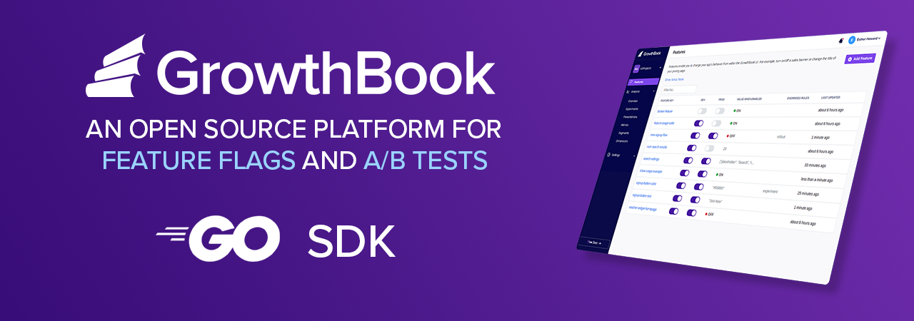

# GrowthBook Go SDK

GrowthBook is a modular feature flagging and experimentation platform.

This is the Go client library that lets you evaluate feature flags and run experiments (A/B tests) within a Go application.

- [Requirements](#requirements)
- [Installation](#installation)
- [Usage](#usage)
- [Documentation](#documentation)

---

## Requirements

- Go version 1.21 or higher (tested with 1.21, 1.22, and 1.23)

---

## Installation

```bash
go get github.com/growthbook/growthbook-golang
```

---

## Usage

### Quick Start

```go
import (
    "context"
    "log"
    gb "github.com/growthbook/growthbook-golang"
)

// Create a new client instance with a client key and 
// a data source that loads features in the background via SSE stream.
// Pass the client's options to the NewClient function.
client, err := gb.NewClient(
    context.Background(),
    gb.WithClientKey("sdk-XXXX"),
    gb.WithSseDataSource(),
) 
defer client.Close()

if err != nil {
    log.Fatal("Client initialization failed: ", err)
}

// The data source starts asynchronously. Use EnsureLoaded to 
// wait until the client data is initialized for the first time.
if err := client.EnsureLoaded(context.Background()); err != nil {
    log.Fatal("Data loading failed: ", err)
}

// Create a child client with specific attributes.
attrs := gb.Attributes{"id": 100, "user": "user1"}
child, err := client.WithAttributes(attrs)
if err != nil {
    log.Fatal("Child client creation failed: ", err)
}

// Evaluate a text feature
buttonColor := child.EvalFeature(context.Background(), "buy-button-color")
if buttonColor.Value == "blue" {
    // Perform actions for blue button
}

// Evaluate a boolean feature
darkMode := child.EvalFeature(context.Background(), "dark-mode")
if darkMode.On {
    // Enable dark mode
}
```

---

### Client

The client is the core component of the GrowthBook SDK. After installing and importing the SDK, create a single shared instance of `growthbook.Client` using the `growthbook.NewClient` function with a list of options. You can customize the client with options like a custom logger, client key, decryption key, default attributes, or a feature list from JSON. The client is thread-safe and can be safely used from multiple goroutines.

While you can evaluate features directly using the main client instance, it’s recommended to create child client instances that include session- or query-specific data. To create a child client with local attributes, call `client.WithAttributes`:

```go
attrs := gb.Attributes{"id": 100, "user": "Bob"}
child, err := client.WithAttributes(attrs)
```

Now, you can evaluate features using the child client:

```go
res := child.EvalFeature(context.Background(), "main-button-color")
```

Additional options, such as `WithLogger`, `WithUrl`, and `WithAttributesOverrides`, can also be used to customize child clients. Since child clients share data with the main client instance, they will automatically receive feature updates.

To stop background updates, call `client.Close()` on the main client instance when it is no longer needed.

---

### Tracking

You can set up two callbacks to track experiment results and feature usage in your analytics or event tracking system:

1. **`ExperimentCallback`**: Triggered when a user is included in an experiment.
2. **`FeatureUsageCallback`**: Triggered on each feature evaluation.

You can also attach extra data that will be sent with each callback. These callbacks can be set globally via the `NewClient` function using the `WithExperimentCallback` and `WithFeatureUsageCallback` options. Alternatively, you can set them locally when creating child clients using similar methods like `client.WithExperimentCallback`. Extra data is set via the `WithExtraData` option.

---

## Documentation

- [Usage Guide](https://docs.growthbook.io/lib/go)
- [GoDoc](https://pkg.go.dev/github.com/growthbook/growthbook-golang)

---
