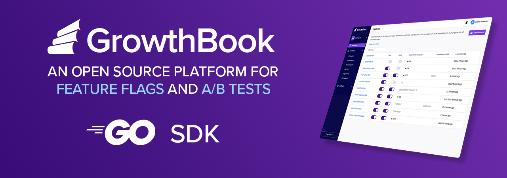

<div align="center">
<h1>GrowthBook Go SDK</h1>

[](https://goreportcard.com/report/github.com/growthbook/growthbook-golang)
[](https://pkg.go.dev/github.com/growthbook/growthbook-golang)
[](https://github.com/growthbook/growthbook-golang/blob/main/LICENSE)
[](https://github.com/growthbook/growthbook-golang/releases/latest)

GrowthBook is a modular feature flagging and experimentation platform. You can use GrowthBook for feature flags, running no-code experiments with a visual editor, analyzing experiment results, or any combination of the above.
</div>

## Requirements

- Go version 1.21 or higher (tested with 1.21, 1.22, and 1.23)

---

## Installation

```bash
go get github.com/growthbook/growthbook-golang
```

---

## Usage

### Quick Start

```go
import (
    "context"
    "log"
    gb "github.com/growthbook/growthbook-golang"
)

// Create a new client instance with a client key and 
// a data source that loads features in the background via SSE stream.
// Pass the client's options to the NewClient function.
client, err := gb.NewClient(
    context.Background(),
    gb.WithClientKey("sdk-XXXX"),
    gb.WithSseDataSource(),
) 
defer client.Close()

if err != nil {
    log.Fatal("Client initialization failed: ", err)
}

// The data source starts asynchronously. Use EnsureLoaded to 
// wait until the client data is initialized for the first time.
if err := client.EnsureLoaded(context.Background()); err != nil {
    log.Fatal("Data loading failed: ", err)
}

// Create a child client with specific attributes.
attrs := gb.Attributes{"id": 100, "user": "user1"}
child, err := client.WithAttributes(attrs)
if err != nil {
    log.Fatal("Child client creation failed: ", err)
}

// Evaluate a text feature
buttonColor := child.EvalFeature(context.Background(), "buy-button-color")
if buttonColor.Value == "blue" {
    // Perform actions for blue button
}

// Evaluate a boolean feature
darkMode := child.EvalFeature(context.Background(), "dark-mode")
if darkMode.On {
    // Enable dark mode
}
```

---

### Client

The client is the core component of the GrowthBook SDK. After installing and importing the SDK, create a single shared instance of `growthbook.Client` using the `growthbook.NewClient` function with a list of options. You can customize the client with options like a custom logger, client key, decryption key, default attributes, or a feature list from JSON. The client is thread-safe and can be safely used from multiple goroutines.

While you can evaluate features directly using the main client instance, it's recommended to create child client instances that include session- or query-specific data. To create a child client with local attributes, call `client.WithAttributes`:

```go
attrs := gb.Attributes{"id": 100, "user": "Bob"}
child, err := client.WithAttributes(attrs)
```

Now, you can evaluate features using the child client:

```go
res := child.EvalFeature(context.Background(), "main-button-color")
```

Additional options, such as `WithLogger`, `WithUrl`, and `WithAttributesOverrides`, can also be used to customize child clients. Since child clients share data with the main client instance, they will automatically receive feature updates.

To stop background updates, call `client.Close()` on the main client instance when it is no longer needed.

---

### Tracking

#### Built-in GrowthBook Tracking Plugin

The SDK includes a built-in tracking plugin that automatically sends experiment and feature evaluation events to the GrowthBook warehouse. This is the easiest way to get analytics data flowing without any custom integration.

```go
client, err := gb.NewClient(
    context.Background(),
    gb.WithClientKey("sdk-XXXX"),
    gb.WithSseDataSource(),
    gb.WithGrowthBookTracking(gb.TrackingPluginConfig{
        // Defaults to "https://us1.gb-ingest.com"
        IngestorHost: "https://us1.gb-ingest.com",
    }),
)
defer client.Close() // flushes remaining events
```

The plugin batches events and sends them in the background. Configuration options:

| Option | Default | Description |
|--------|---------|-------------|
| `IngestorHost` | `https://us1.gb-ingest.com` | GrowthBook event ingestor endpoint |
| `BatchSize` | `100` | Max events before auto-flush |
| `BatchTimeout` | `10s` | Max wait time before auto-flush |
| `HTTPClient` | Client's HTTP client | Custom HTTP client for sending events |
| `Logger` | Client's logger | Custom logger for error reporting |

Events tracked automatically:
- **`experiment_viewed`** — when a user is bucketed into an experiment
- **`feature_evaluated`** — every time a feature flag is evaluated

If plugin initialization fails (e.g., missing client key), the plugin silently becomes a no-op — it never interferes with SDK evaluation.

#### Custom Tracking via Callbacks

For custom analytics integrations, you can set up two callbacks:

1. **`ExperimentCallback`**: Triggered when a user is included in an experiment.
2. **`FeatureUsageCallback`**: Triggered on each feature evaluation.

You can also attach extra data that will be sent with each callback. These callbacks can be set globally via the `NewClient` function using the `WithExperimentCallback` and `WithFeatureUsageCallback` options. Alternatively, you can set them locally when creating child clients using similar methods like `client.WithExperimentCallback`. Extra data is set via the `WithExtraData` option.

```go
client, err := gb.NewClient(
    context.Background(),
    gb.WithClientKey("sdk-XXXX"),
    gb.WithExperimentCallback(func(ctx context.Context, exp *gb.Experiment, result *gb.ExperimentResult, extraData any) {
        // Send to your analytics provider
    }),
    gb.WithFeatureUsageCallback(func(ctx context.Context, key string, result *gb.FeatureResult, extraData any) {
        // Track feature usage
    }),
    gb.WithExtraData(myAnalyticsService),
)
```

Callbacks and the tracking plugin can be used together — they operate independently.

#### Custom Plugins

You can implement the `Plugin` interface to create custom tracking or other plugins:

```go
type Plugin interface {
    Init(client *gb.Client) error
    OnExperimentViewed(ctx context.Context, experiment *gb.Experiment, result *gb.ExperimentResult)
    OnFeatureEvaluated(ctx context.Context, featureKey string, result *gb.FeatureResult)
    Close() error
}
```

Register custom plugins using `WithPlugins`:

```go
client, err := gb.NewClient(
    context.Background(),
    gb.WithClientKey("sdk-XXXX"),
    gb.WithPlugins(myCustomPlugin),
)
```

Plugins are shared with child clients. Any panics in plugin methods are recovered and logged — they never interrupt SDK evaluation.

---

### Sticky Bucketing

Sticky Bucketing ensures users see consistent experiment variations across sessions and devices. The SDK provides an in-memory implementation by default, but you can implement your own storage solution.

#### Basic Usage

```go
// Create an in-memory sticky bucket service
service := gb.NewInMemoryStickyBucketService()

// Create a client with sticky bucketing
client, err := gb.NewClient(
    context.Background(),
    gb.WithClientKey("sdk-XXXX"),
    gb.WithStickyBucketService(service),
)

// Run an experiment with sticky bucketing
exp := &gb.Experiment{
    Key:        "my-experiment",
    Variations: []gb.FeatureValue{"control", "treatment"},
    Meta: []gb.VariationMeta{
        {Key: "0"}, // Use numeric keys to match variation IDs
        {Key: "1"},
    },
    BucketVersion:    1,
    MinBucketVersion: 0,
}

result := client.RunExperiment(context.Background(), exp)
```

#### Custom Implementation

Implement the `StickyBucketService` interface for custom storage:

#### Concurrency & Caching

- The in-memory implementation is thread-safe using `sync.RWMutex`
- Assignments are cached in memory to reduce storage calls
- Cache is shared across all clients using the same service instance

For more details, see the [official documentation](https://docs.growthbook.io/app/sticky-bucketing).

---

## Documentation

- [Usage Guide](https://docs.growthbook.io/lib/go)
- [GoDoc](https://pkg.go.dev/github.com/growthbook/growthbook-golang)

---
